# AgriSight AI Models and Applications

## Overview

AgriSight leverages a comprehensive suite of artificial intelligence and machine learning models to analyze satellite imagery, detect agricultural anomalies, and provide actionable insights for food security monitoring in conflict-affected regions. The system employs a multi-stage approach combining traditional machine learning with state-of-the-art deep learning techniques.

## Model Architecture Overview

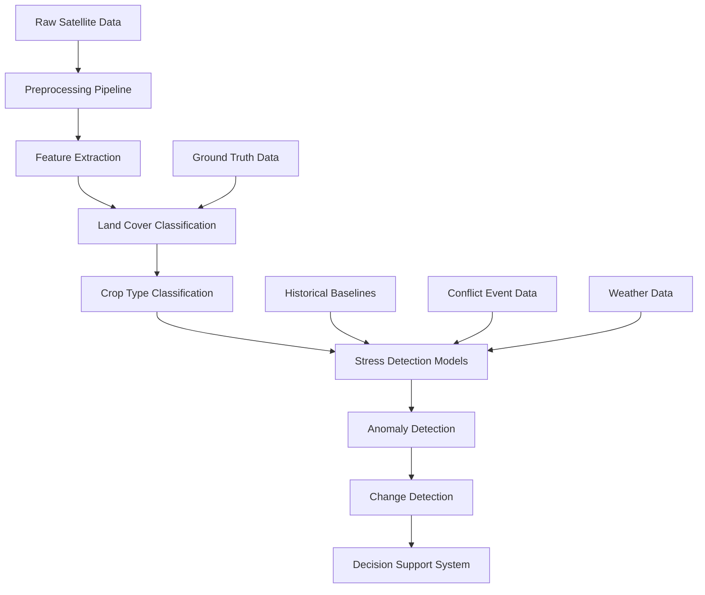

## Core Machine Learning Models

### 1. Land Cover Classification Models

#### Random Forest Classifier
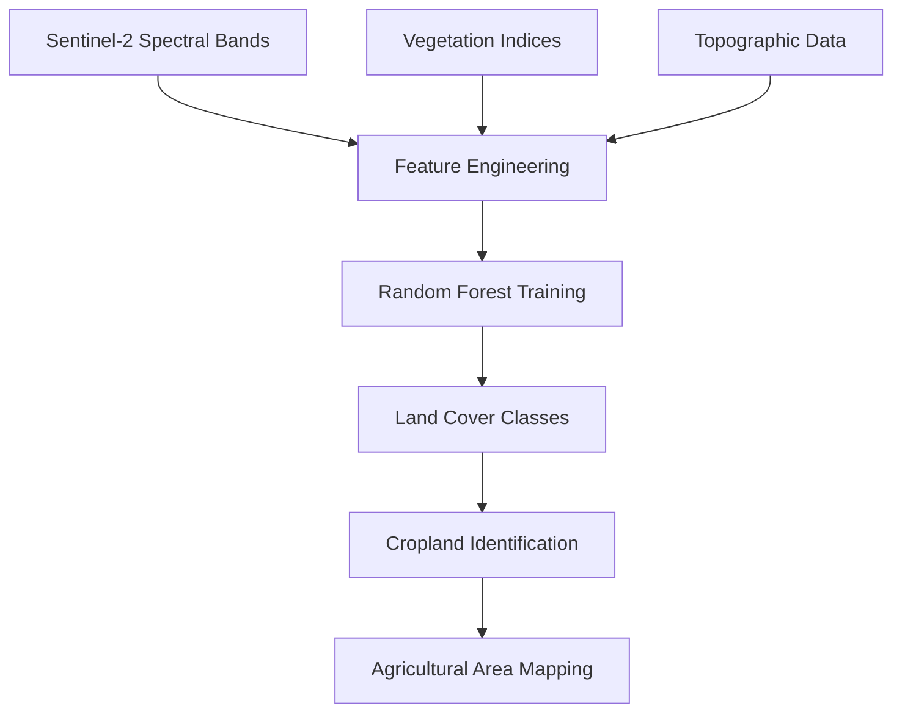

**Implementation Details:**
- **Algorithm**: Random Forest with 100-500 trees
- **Features**: 7 spectral bands + 4 vegetation indices (NDVI, EVI, NDWI, SAVI)
- **Classes**: Cropland, Forest, Water, Urban, Bare Soil, Wetland
- **Accuracy**: 85-92% overall accuracy
- **Training Data**: 10,000+ labeled pixels per class
- **Validation**: 5-fold cross-validation

**Code Implementation:**
```python
from sklearn.ensemble import RandomForestClassifier
from sklearn.model_selection import train_test_split
from sklearn.metrics import classification_report

# Feature preparation
features = np.column_stack([
    image_data['B2'], image_data['B3'], image_data['B4'], image_data['B8'],
    image_data['NDVI'], image_data['EVI'], image_data['NDWI'], image_data['SAVI']
])

# Model training
rf_model = RandomForestClassifier(
    n_estimators=200,
    max_depth=15,
    min_samples_split=5,
    random_state=42
)
rf_model.fit(X_train, y_train)

# Prediction and validation
predictions = rf_model.predict(X_test)
print(classification_report(y_test, predictions))
```

#### Support Vector Machine (SVM)
**Application**: High-dimensional feature classification
**Kernel**: Radial Basis Function (RBF)
**Advantages**: Effective with limited training data
**Use Case**: Initial classification when computational resources are limited

### 2. Crop Type Classification Models

#### PSETAE (Pixel-Set Encoder with Temporal Attention Encoder)
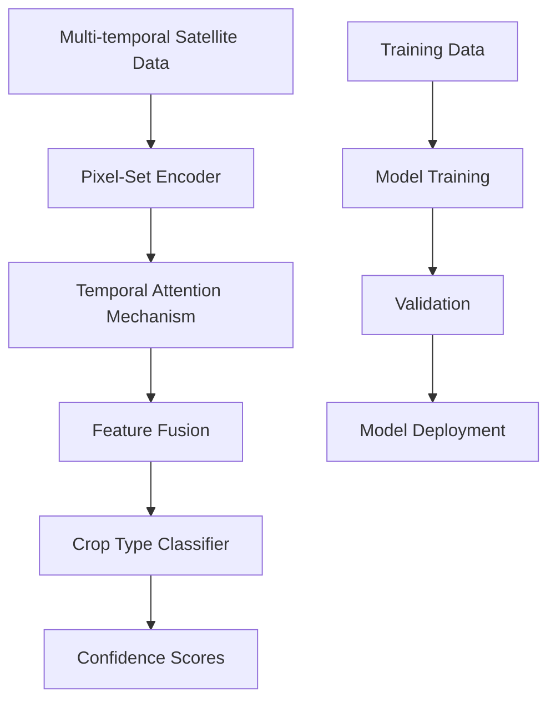

**Architecture Details:**
- **Input Format**: Spectro-temporal tensors (T×C×N)
  - T: Temporal observations (9-12 monthly composites)
  - C: Spectral channels (7 Sentinel-2 bands)
  - N: Number of pixels per field
- **Encoder**: Transformer-based pixel-set encoder
- **Attention**: Temporal attention mechanism for crop phenology
- **Output**: Crop type probabilities with confidence scores

**Implementation Framework:**
```python
# PSETAE model architecture (conceptual)
class PSETAE:
    def __init__(self, temporal_length=12, spectral_channels=7):
        self.pixel_encoder = PixelSetEncoder(spectral_channels)
        self.temporal_attention = TemporalAttention(temporal_length)
        self.classifier = CropTypeClassifier()
    
    def forward(self, x):
        # x shape: (batch_size, temporal_length, spectral_channels, pixels)
        pixel_features = self.pixel_encoder(x)
        temporal_features = self.temporal_attention(pixel_features)
        crop_predictions = self.classifier(temporal_features)
        return crop_predictions
```

**Training Strategy:**
- **Transfer Learning**: Pre-trained on global crop datasets
- **Fine-tuning**: Adapted for DRC-specific crops (cassava, maize, plantains)
- **Data Augmentation**: Temporal and spectral augmentation
- **Loss Function**: Cross-entropy with class weighting for imbalanced data

#### Convolutional Neural Networks (CNNs)

##### U-Net Architecture
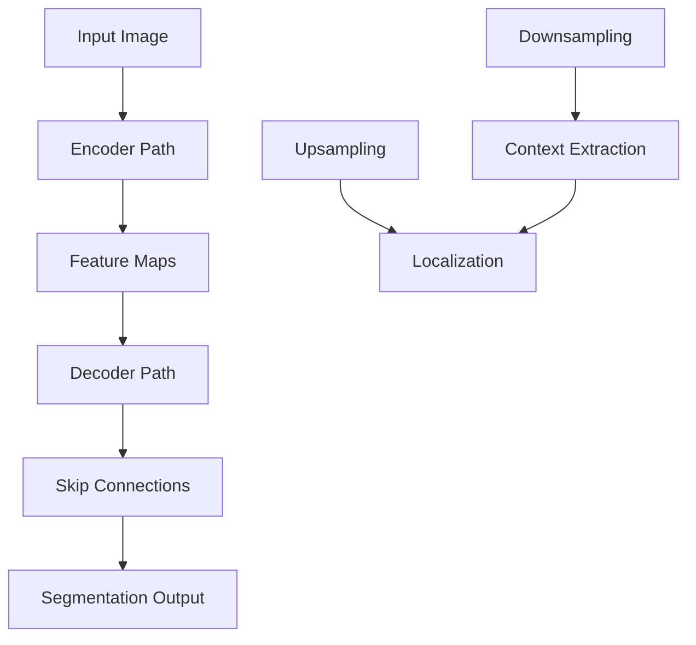

**Implementation:**
- **Architecture**: U-Net with ResNet backbone
- **Input**: 512×512 pixel patches with 7 spectral bands
- **Output**: Pixel-wise crop type classification
- **Loss Function**: Dice loss + Cross-entropy
- **Optimizer**: Adam with learning rate scheduling

##### EfficientNet
- **Purpose**: Efficient crop classification with limited computational resources
- **Architecture**: EfficientNet-B3 for balanced accuracy/speed
- **Input Resolution**: 224×224 pixels
- **Applications**: Real-time crop type identification

### 3. Agricultural Stress Detection Models

#### Isolation Forest for Anomaly Detection
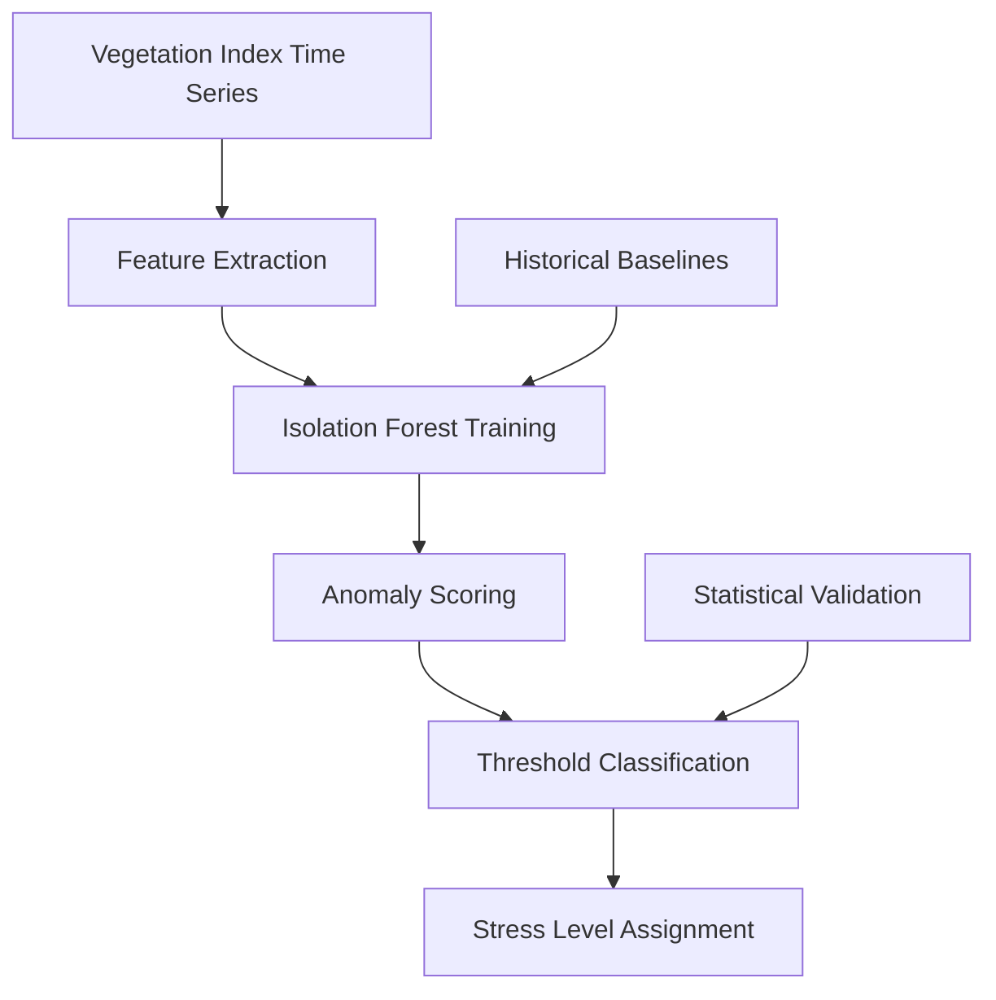

**Implementation:**
```python
from sklearn.ensemble import IsolationForest
import numpy as np

# Prepare time series features
def extract_temporal_features(ndvi_series, evi_series, ndwi_series):
    features = []
    for series in [ndvi_series, evi_series, ndwi_series]:
        # Statistical features
        features.extend([
            np.mean(series), np.std(series), np.min(series), np.max(series),
            np.percentile(series, 25), np.percentile(series, 75)
        ])
        # Trend features
        features.append(np.polyfit(range(len(series)), series, 1)[0])
    return np.array(features)

# Train isolation forest
iso_forest = IsolationForest(
    contamination=0.1,  # Expected proportion of anomalies
    random_state=42
)
iso_forest.fit(training_features)

# Detect anomalies
anomaly_scores = iso_forest.decision_function(test_features)
anomaly_labels = iso_forest.predict(test_features)
```

#### Autoencoder for Stress Pattern Recognition
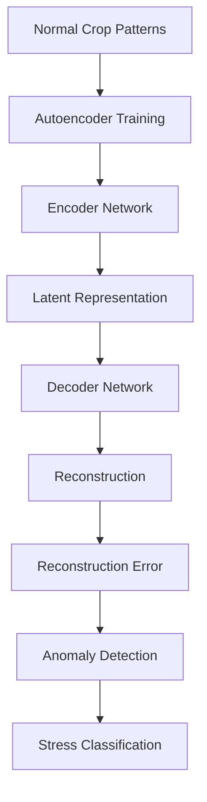

**Architecture:**
- **Input**: 64×64 pixel patches with vegetation indices
- **Encoder**: 4 convolutional layers with batch normalization
- **Latent Space**: 128-dimensional representation
- **Decoder**: 4 transposed convolutional layers
- **Loss**: Mean Squared Error + Kullback-Leibler divergence

### 4. Change Detection Models

#### Time Series Analysis Models
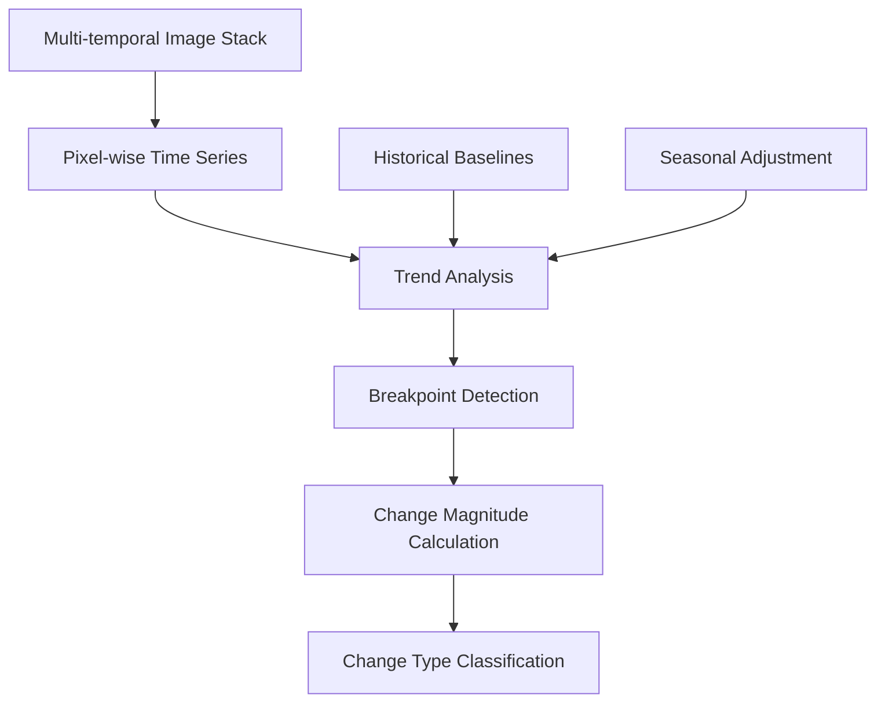

**Methods:**
1. **Post-classification Comparison**
   - Independent classification of multi-temporal images
   - Change detection through class comparison
   - Advantage: Interpretable results

2. **Direct Multi-date Classification**
   - Input: Stacked multi-temporal images
   - Output: Change/no-change classification
   - Advantage: Contextual information utilization

3. **Change Vector Analysis**
   - Magnitude: Euclidean distance in feature space
   - Direction: Angle in feature space
   - Advantage: Quantitative change assessment

#### Segment Anything Model (SAM) Adaptations
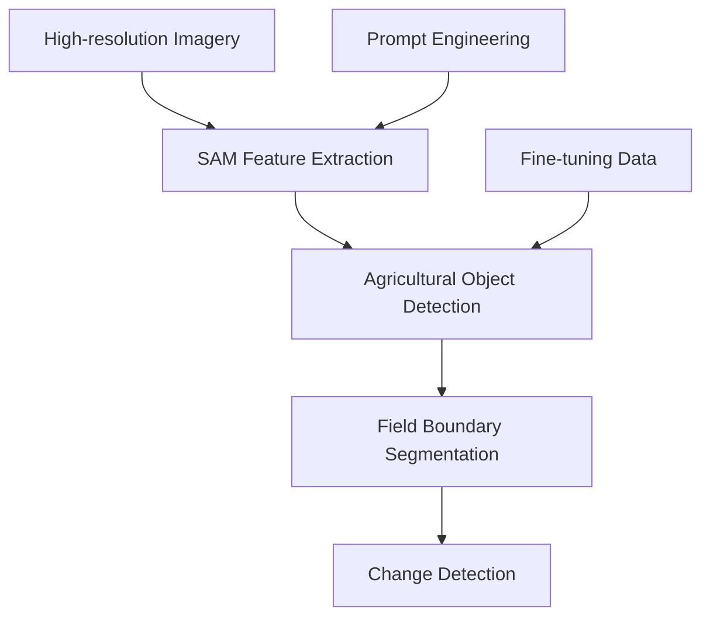

**Implementation Strategy:**
- **Base Model**: Segment Anything Model (SAM)
- **Adaptation**: Fine-tuning for agricultural objects
- **Applications**: Field boundary detection, crop field segmentation
- **Advantages**: Zero-shot capabilities, high accuracy

### 5. Deep One-Class Crop Classification (DOCC)

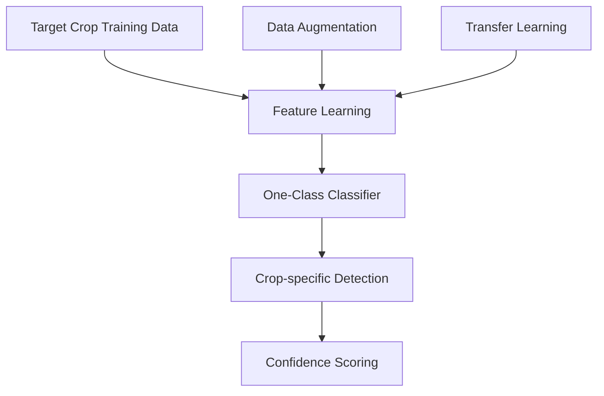

**Applications:**
- **High-value Crops**: Cassava, maize monitoring
- **Illegal Cultivation**: Opium poppy detection
- **Crop-specific Stress**: Disease monitoring for specific crops
- **Advantages**: Reduced labeling requirements, focused monitoring

## Model Training and Validation

### Training Data Strategy
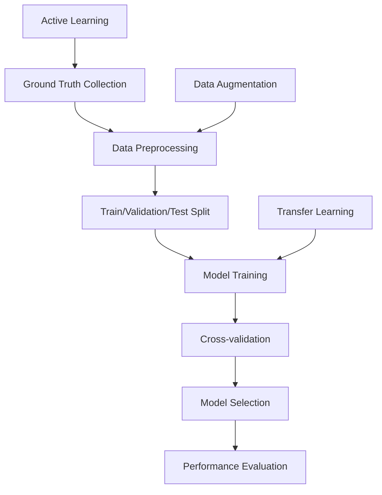

**Data Sources:**
1. **Ground Truth Data**: Limited field surveys in accessible areas
2. **Expert Knowledge**: Agricultural expert annotations
3. **Transfer Learning**: Models trained on similar agricultural regions
4. **Synthetic Data**: Generated training samples for rare events
5. **Active Learning**: Iterative model improvement with expert feedback

### Validation Methods
1. **Cross-validation**: 5-fold stratified cross-validation
2. **Temporal Validation**: Train on historical data, test on recent data
3. **Spatial Validation**: Train on one region, test on another
4. **Expert Validation**: Agricultural expert review of model outputs
5. **Statistical Validation**: Confidence intervals and uncertainty quantification

### Performance Metrics
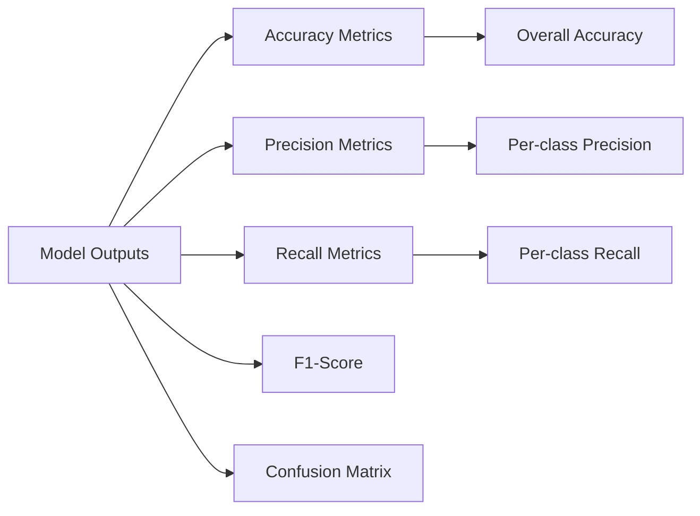

**Key Metrics:**
- **Overall Accuracy**: >85% for land cover classification
- **Precision**: >90% for high-confidence predictions
- **Recall**: >80% for stress event detection
- **F1-Score**: >85% for crop type classification
- **Confidence Intervals**: 95% confidence intervals for all predictions

## Model Deployment and Monitoring

### Deployment Architecture
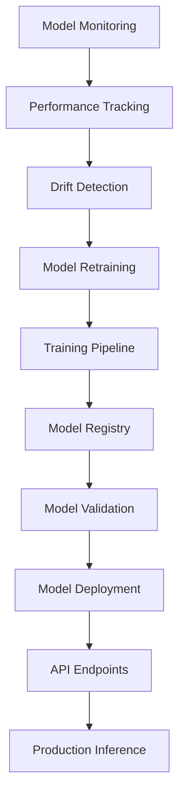

**Deployment Strategy:**
1. **Containerization**: Docker containers for model serving
2. **API Gateway**: RESTful APIs for model access
3. **Load Balancing**: Multiple model instances for scalability
4. **Caching**: Redis caching for frequently requested predictions
5. **Monitoring**: Real-time performance monitoring and alerting

### Model Monitoring
- **Performance Metrics**: Accuracy, latency, throughput monitoring
- **Data Drift**: Detection of input data distribution changes
- **Model Drift**: Detection of model performance degradation
- **A/B Testing**: Comparison of model versions in production
- **Automated Retraining**: Triggered retraining based on performance thresholds

## Integration with External Systems

### Google Earth Engine Integration


**Benefits:**
- **Scalability**: Process large-scale satellite imagery
- **Cost-effectiveness**: Pay-per-use cloud computing
- **Data Access**: Direct access to satellite data archives
- **Integration**: Seamless integration with existing GEE workflows

### Sentinel Hub Integration


**Features:**
- **Custom Processing**: JavaScript-based image processing
- **Real-time Access**: Latest satellite imagery
- **Flexible Output**: Multiple output formats and resolutions
- **Cloud Masking**: Built-in cloud and shadow detection

## Model Performance Optimization

### Computational Optimization
1. **Model Quantization**: Reduced precision for faster inference
2. **Model Pruning**: Removal of unnecessary model parameters
3. **Batch Processing**: Efficient batch inference for multiple images
4. **GPU Acceleration**: CUDA-based acceleration for deep learning models
5. **Edge Deployment**: Optimized models for edge computing devices

### Accuracy Optimization
1. **Ensemble Methods**: Combination of multiple models for improved accuracy
2. **Active Learning**: Iterative model improvement with expert feedback
3. **Transfer Learning**: Leveraging pre-trained models for better performance
4. **Data Augmentation**: Synthetic data generation for improved generalization
5. **Multi-modal Fusion**: Integration of optical and SAR data

## Future Research Directions

### Advanced Model Architectures
1. **Vision Transformers**: Transformer-based models for satellite imagery
2. **Graph Neural Networks**: Spatial relationship modeling in agricultural landscapes
3. **Reinforcement Learning**: Adaptive model training based on feedback
4. **Federated Learning**: Distributed training across multiple organizations
5. **Continual Learning**: Models that learn continuously without forgetting

### Emerging Applications
1. **Precision Agriculture**: Field-level management recommendations
2. **Climate Adaptation**: Models for climate change impact assessment
3. **Food Security Prediction**: Early warning systems for food insecurity
4. **Supply Chain Optimization**: Integration with agricultural supply chains
5. **Policy Support**: Evidence-based policy recommendations

## Conclusion

The AgriSight AI model suite represents a comprehensive approach to agricultural monitoring using state-of-the-art machine learning techniques. By combining traditional methods with advanced deep learning architectures, the system achieves high accuracy while maintaining interpretability and scalability.

The multi-model approach ensures robust performance across different agricultural conditions and crop types, while the integration with cloud-based processing platforms enables real-time monitoring at scale. Continuous model improvement through active learning and expert feedback ensures the system remains relevant and accurate as agricultural conditions and monitoring requirements evolve.

The modular architecture allows for easy integration of new models and techniques as they become available, ensuring the system remains at the forefront of agricultural monitoring technology.
