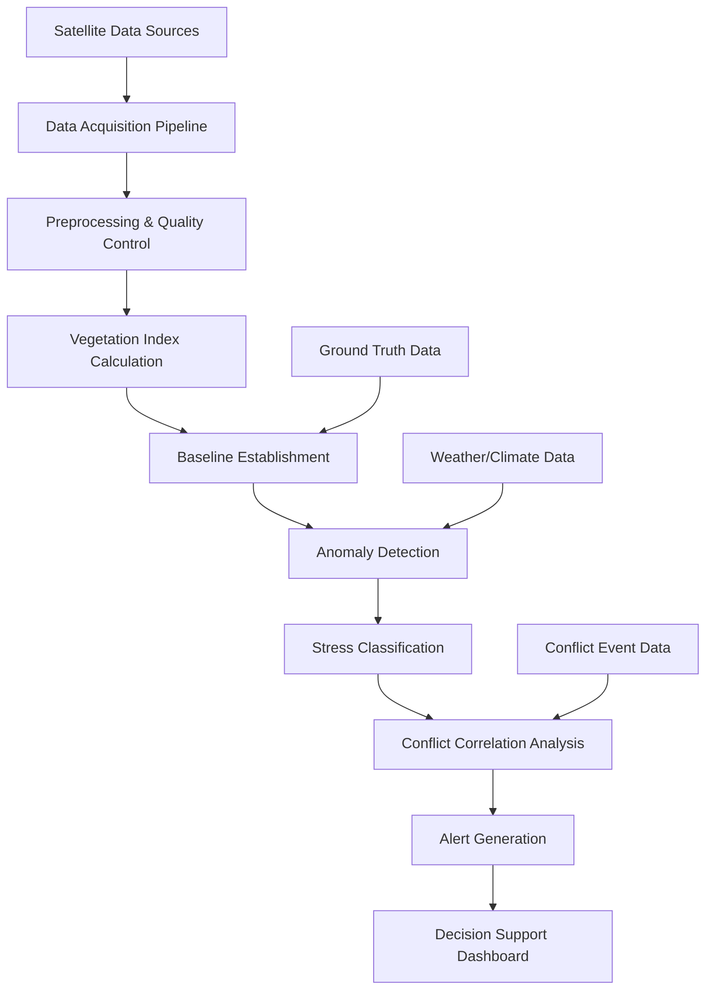
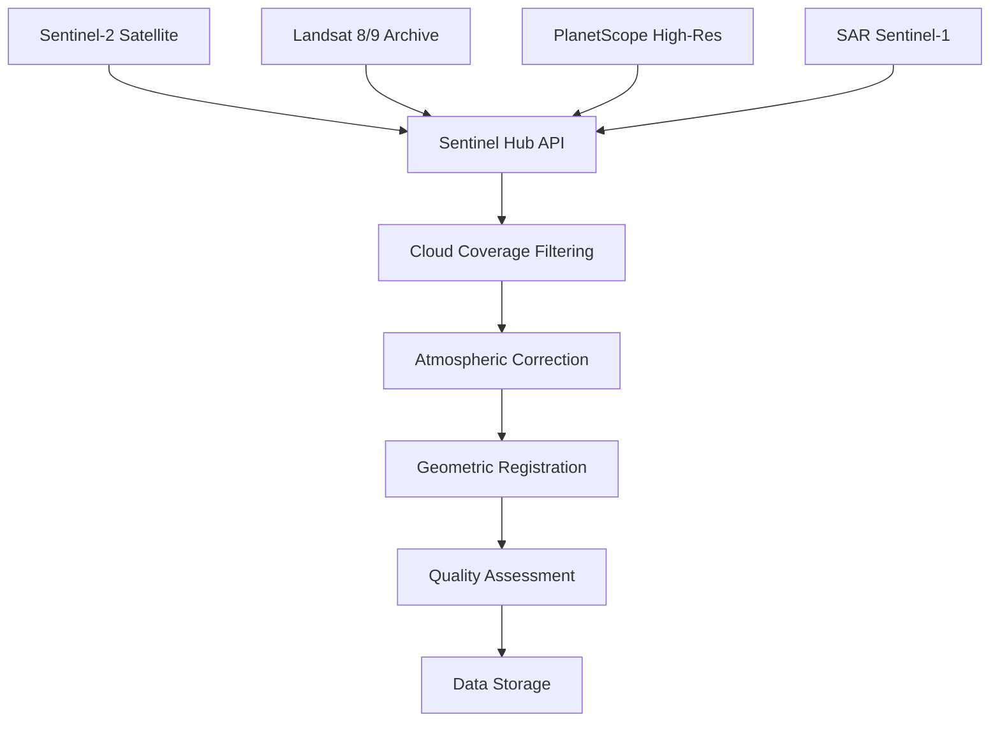
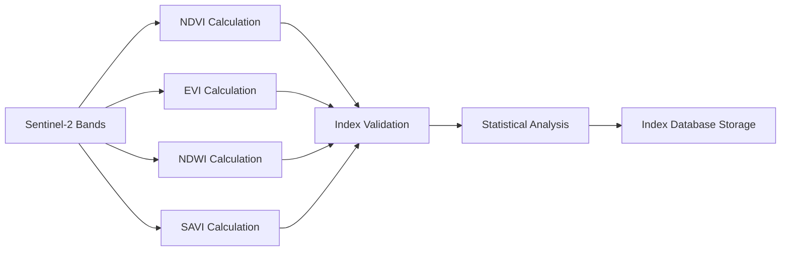
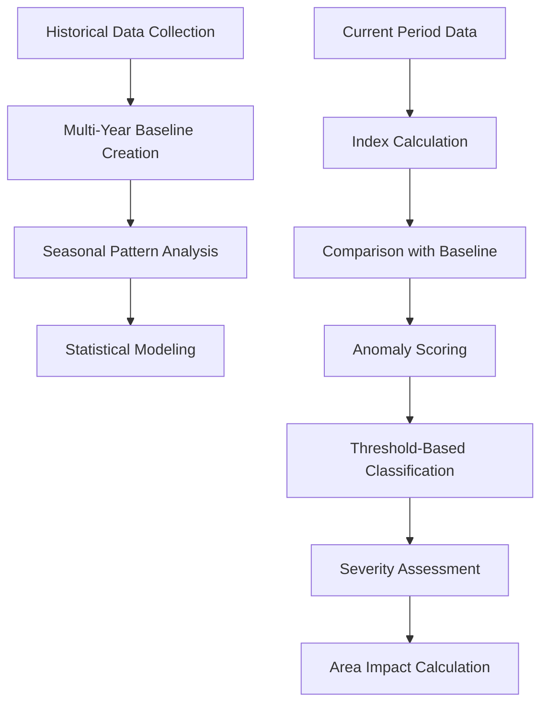
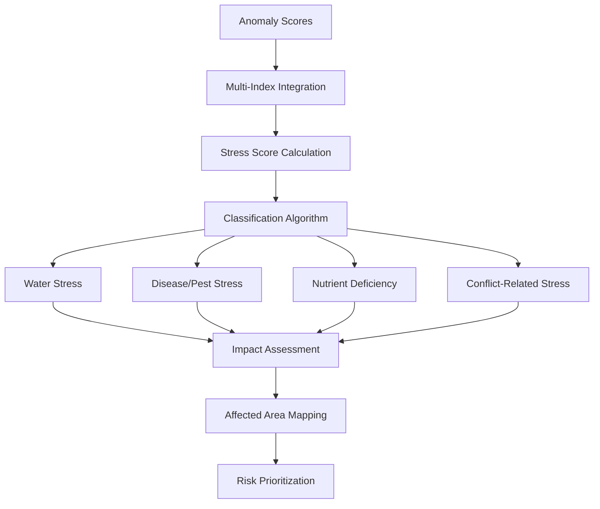
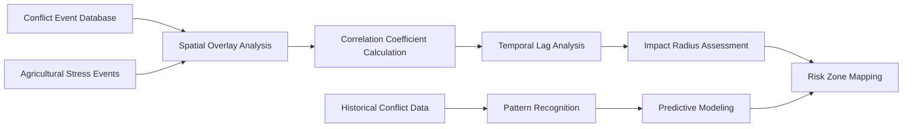
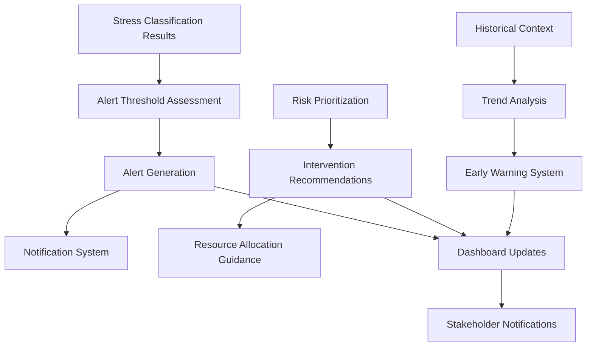
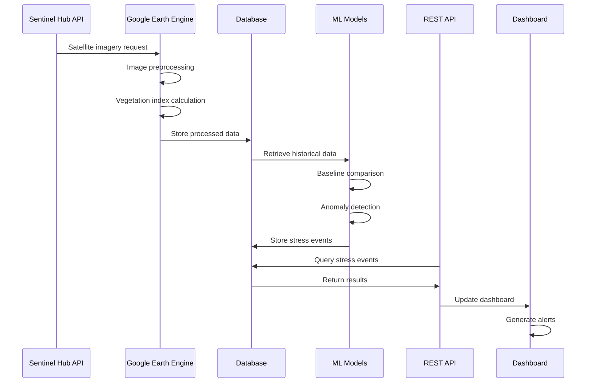

# AgriSight Crop Stress Detection Workflow

## Overview

AgriSight employs a comprehensive multi-stage pipeline for detecting agricultural stress in conflict-affected regions of the Democratic Republic of Congo (DRC). The system combines satellite imagery analysis, machine learning models, and geospatial analytics to provide real-time insights for food security monitoring.

## System Architecture

## Detailed Workflow Process

### 1. Data Acquisition Pipeline

**Data Sources:**
- **Primary**: Sentinel-2 (10m resolution, 5-day revisit)
- **Historical**: Landsat 8/9 (30m resolution, 16-day revisit)
- **High-resolution**: PlanetScope (3-5m resolution, daily)
- **All-weather**: Sentinel-1 SAR (10-20m resolution, 6-day revisit)

**Quality Control:**
- Cloud coverage filtering (< 20% for optical imagery)
- Atmospheric correction using SMAC or Sen2Cor
- Geometric co-registration with sub-pixel accuracy
- Temporal compositing for cloud-free observations

### 2. Vegetation Index Calculation

**Vegetation Indices Used:**

1. **NDVI (Normalized Difference Vegetation Index)**
   - Formula: (NIR - Red) / (NIR + Red)
   - Purpose: General vegetation health and density
   - Range: -1 to +1 (typically 0.2-0.8 for vegetation)

2. **EVI (Enhanced Vegetation Index)**
   - Formula: 2.5 × [(NIR - Red) / (NIR + 6×Red - 7.5×Blue + 1)]
   - Purpose: Improved performance in high LAI areas
   - Advantage: Reduced atmospheric effects, better for tropical regions

3. **NDWI (Normalized Difference Water Index)**
   - Formula: (Green - NIR) / (Green + NIR)
   - Purpose: Vegetation water content and drought monitoring
   - Application: Critical for water stress detection

4. **SAVI (Soil-Adjusted Vegetation Index)**
   - Formula: [(NIR - Red) / (NIR + Red + L)] × (1 + L)
   - Purpose: Soil background correction
   - Parameter: L-factor (typically 0.5)

### 3. Baseline Establishment and Anomaly Detection

**Baseline Methodology:**
- **Time Period**: 3-5 years of historical data
- **Seasonal Adjustment**: Monthly composites accounting for crop calendars
- **Statistical Measures**: Mean, standard deviation, percentiles
- **Regional Variation**: Province-specific baselines for DRC

**Anomaly Detection:**
- **Statistical Thresholds**: Z-score based detection
- **Temporal Consistency**: Multi-date validation
- **Spatial Context**: Neighboring region comparison
- **Severity Levels**: 5-point scale (1=mild to 5=severe)

### 4. Stress Classification and Analysis

**Stress Types Identified:**
1. **Water Stress**: NDWI-based detection, drought indicators
2. **Disease/Pest**: Vegetation pattern anomalies, irregular growth
3. **Nutrient Deficiency**: Chlorophyll content analysis, growth retardation
4. **Conflict-Related**: Spatial correlation with conflict events, abandonment patterns

### 5. Conflict Correlation Analysis

**Conflict Integration:**
- **Event Types**: M23 activity, FDLR presence, ADF conflicts
- **Spatial Analysis**: Buffer zones around conflict events
- **Temporal Analysis**: Pre/post conflict agricultural patterns
- **Impact Assessment**: Quantified relationship between conflict and stress

### 6. Alert Generation and Decision Support

**Alert Categories:**
- **Level 1**: Low risk, monitoring recommended
- **Level 2**: Moderate risk, enhanced monitoring
- **Level 3**: High risk, intervention recommended
- **Level 4**: Critical risk, immediate action required
- **Level 5**: Emergency, humanitarian response needed

## Technical Implementation

### Data Processing Pipeline

### Machine Learning Models

**Primary Models:**
1. **PSETAE (Pixel-Set Encoder with Temporal Attention)**
   - Architecture: Transformer-based for time series
   - Application: Crop type classification
   - Input: Multi-temporal spectral data

2. **Random Forest Classifier**
   - Application: Initial land cover mapping
   - Features: Spectral bands + vegetation indices
   - Output: Land cover classes

3. **Isolation Forest**
   - Application: Anomaly detection
   - Method: Unsupervised learning
   - Purpose: Identify unusual patterns

4. **CNN (Convolutional Neural Networks)**
   - Architecture: U-Net with skip connections
   - Application: Spatial pattern recognition
   - Purpose: Field boundary detection

## Output Products

### 1. Stress Maps
- **Spatial Resolution**: 10m (Sentinel-2)
- **Temporal Resolution**: Weekly updates
- **Classification**: 5-level stress severity
- **Format**: GeoTIFF, PNG visualization

### 2. Analytics Dashboard
- **Real-time Monitoring**: Live stress indicators
- **Historical Trends**: Multi-year analysis
- **Regional Comparisons**: Province-level insights
- **Alert Management**: Automated notifications

### 3. Reports and Alerts
- **Automated Reports**: Weekly/monthly summaries
- **Custom Analysis**: On-demand reports
- **API Access**: Programmatic data access
- **Export Formats**: PDF, Excel, GeoJSON

## Quality Assurance

### Validation Methods
1. **Ground Truth Comparison**: Limited field validation where possible
2. **Cross-validation**: Multiple satellite sources comparison
3. **Expert Review**: Agricultural expert validation
4. **Statistical Validation**: Confidence intervals and uncertainty quantification

### Accuracy Metrics
- **Overall Accuracy**: >85% for stress detection
- **False Positive Rate**: <10%
- **Temporal Consistency**: >90% agreement across time periods
- **Spatial Accuracy**: <50m geolocation error

## Challenges and Mitigation

### Technical Challenges
1. **Cloud Cover**: Frequent cloud cover in tropical regions
   - *Mitigation*: SAR data integration, temporal compositing
2. **Small-scale Agriculture**: Fragmented plots in DRC
   - *Mitigation*: High-resolution imagery, object-based analysis
3. **Limited Ground Truth**: Scarce validation data in conflict zones
   - *Mitigation*: Transfer learning, expert knowledge integration

### Operational Challenges
1. **Data Latency**: Processing delays
   - *Mitigation*: Automated pipelines, cloud processing
2. **False Alarms**: Noise in stress detection
   - *Mitigation*: Multi-date validation, statistical filtering
3. **Resource Constraints**: Computational requirements
   - *Mitigation*: Cloud-based processing, efficient algorithms

## Future Enhancements

### Planned Improvements
1. **Real-time Processing**: Near-real-time stress detection
2. **Enhanced Models**: Deep learning model improvements
3. **Additional Indices**: Expanded vegetation index suite
4. **Mobile Integration**: Field data collection apps
5. **Predictive Analytics**: Early warning system enhancements

### Research Directions
1. **Multi-modal Fusion**: Integration of optical and SAR data
2. **Crop-specific Models**: Specialized models for DRC crops
3. **Climate Integration**: Weather data incorporation
4. **Social Media Mining**: Conflict event detection from social media
5. **Blockchain Integration**: Secure data provenance tracking

## Conclusion

The AgriSight crop stress detection workflow provides a comprehensive, automated system for monitoring agricultural conditions in conflict-affected regions. By combining advanced satellite imagery analysis with machine learning techniques, the system delivers actionable insights that support food security interventions and humanitarian response efforts.

The multi-stage pipeline ensures robust data quality while the integration of conflict data provides context for understanding agricultural stress patterns. The system's modular architecture allows for continuous improvement and adaptation to changing requirements and technological advances.
