# AgriSight Data Outputs and Food Security Applications

## Executive Summary

AgriSight generates a comprehensive suite of data outputs designed to support food security monitoring, humanitarian response, and agricultural development in conflict-affected regions of the Democratic Republic of Congo (DRC). The system produces actionable insights that guide decision-making for humanitarian organizations, government agencies, and agricultural cooperatives working to address food insecurity.

## Data Output Ecosystem

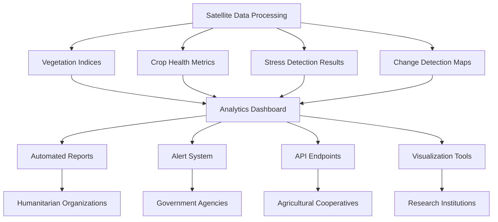

## Primary Data Outputs

### 1. Agricultural Stress Maps

#### Spatial Stress Distribution
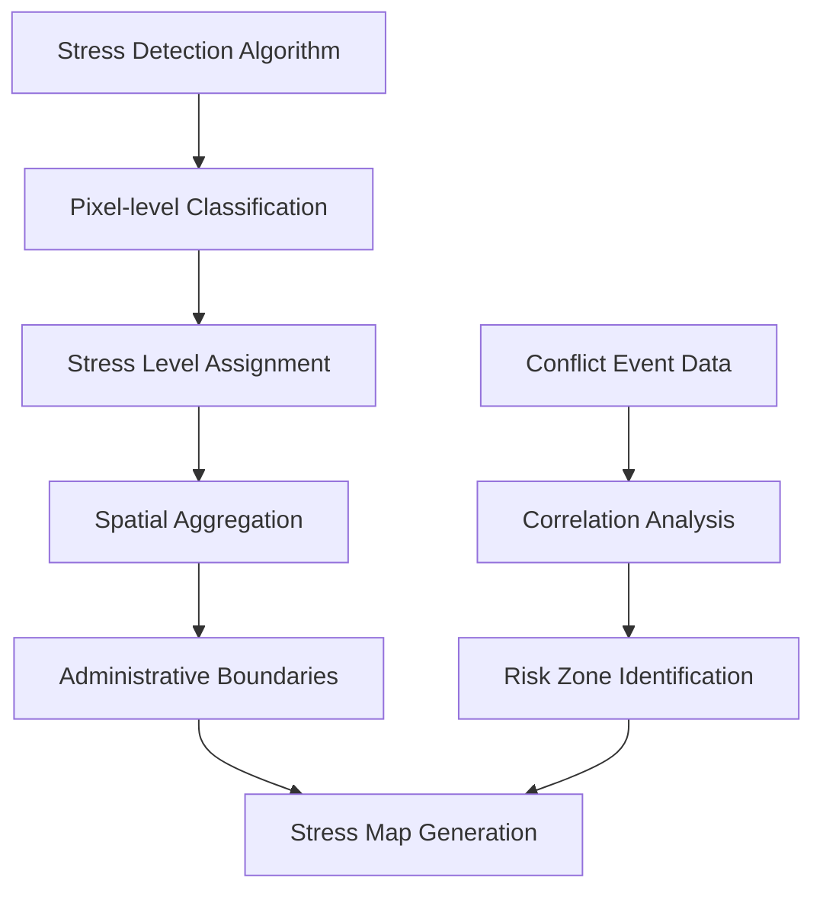

**Output Specifications:**
- **Spatial Resolution**: 10m (Sentinel-2 native resolution)
- **Temporal Resolution**: Weekly updates
- **Classification Levels**: 5-level severity scale (0-4)
- **Coverage**: North Kivu, South Kivu, Ituri provinces
- **Format**: GeoTIFF, PNG visualization, GeoJSON

**Stress Categories:**
1. **Level 0**: No Stress (Healthy vegetation)
2. **Level 1**: Low Stress (Mild vegetation anomalies)
3. **Level 2**: Moderate Stress (Significant vegetation decline)
4. **Level 3**: High Stress (Severe vegetation stress)
5. **Level 4**: Critical Stress (Crop failure risk)

#### Temporal Stress Trends
- **Historical Baselines**: 3-5 year reference periods
- **Seasonal Patterns**: Monthly stress variation analysis
- **Trend Analysis**: Long-term stress trajectory assessment
- **Anomaly Detection**: Statistical deviation from normal patterns

### 2. Vegetation Index Products

#### NDVI (Normalized Difference Vegetation Index)
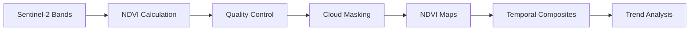

**Applications:**
- **Crop Health Monitoring**: General vegetation health assessment
- **Growth Stage Identification**: Crop development tracking
- **Yield Prediction**: Early yield estimation models
- **Drought Monitoring**: Water stress identification

#### EVI (Enhanced Vegetation Index)
**Applications:**
- **High LAI Areas**: Improved performance in dense vegetation
- **Atmospheric Correction**: Better performance in hazy conditions
- **Tropical Agriculture**: Optimized for DRC agricultural systems

#### NDWI (Normalized Difference Water Index)
**Applications:**
- **Water Stress Detection**: Early drought identification
- **Irrigation Monitoring**: Water resource assessment
- **Flood Detection**: Water body expansion monitoring

#### SAVI (Soil-Adjusted Vegetation Index)
**Applications:**
- **Bare Soil Areas**: Improved accuracy in sparse vegetation
- **Early Season Monitoring**: Better performance during planting
- **Soil Moisture Estimation**: Indirect soil moisture assessment

### 3. Crop Type Classification Maps

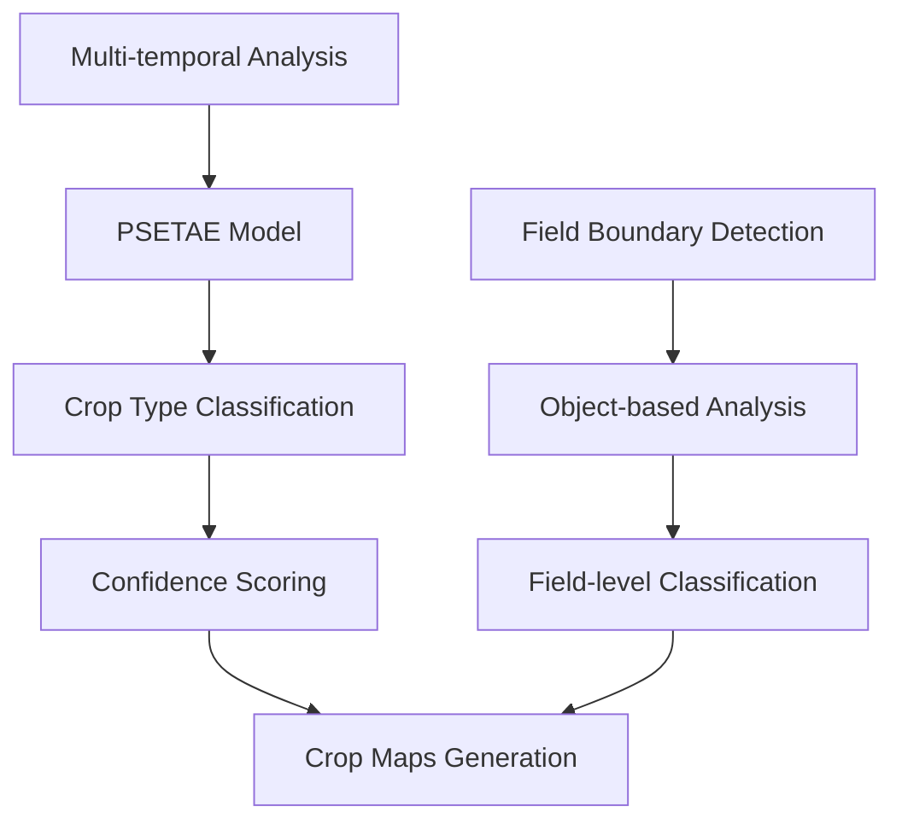

**Crop Categories:**
1. **Staple Crops**: Cassava, maize, plantains, rice
2. **Cash Crops**: Coffee, cocoa, palm oil
3. **Vegetables**: Tomatoes, onions, leafy greens
4. **Legumes**: Beans, groundnuts, soybeans
5. **Other**: Mixed crops, fallow land

**Output Specifications:**
- **Accuracy**: >85% for major crop types
- **Confidence Scores**: 0-100% confidence levels
- **Update Frequency**: Monthly during growing seasons
- **Spatial Resolution**: 10m pixel resolution

### 4. Land Use Change Detection

#### Change Detection Maps
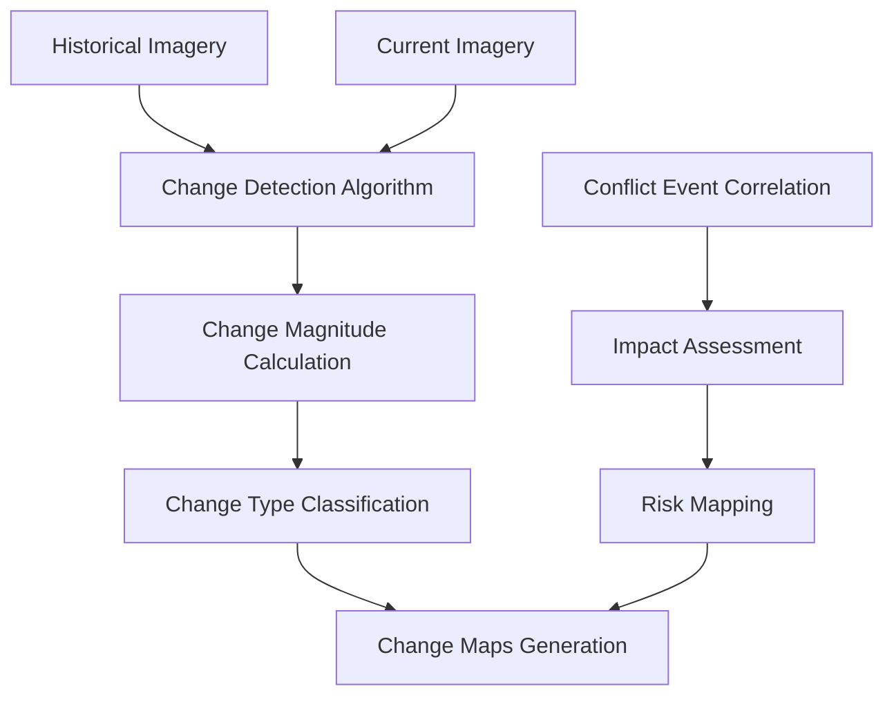

**Change Categories:**
1. **Agricultural Expansion**: New cropland development
2. **Agricultural Abandonment**: Cropland to other land use
3. **Deforestation**: Forest to agricultural conversion
4. **Urbanization**: Agricultural to urban conversion
5. **Water Body Changes**: Flooding, drought effects

### 5. Conflict-Agriculture Correlation Analysis

#### Spatial Correlation Maps
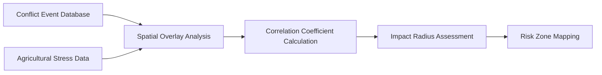

**Analysis Components:**
- **Spatial Correlation**: Geographic relationship between conflict and stress
- **Temporal Correlation**: Time-lagged impact analysis
- **Impact Radius**: Estimated agricultural impact zones
- **Risk Assessment**: Probability of agricultural disruption

## Analytics and Reporting System

### 1. Real-time Dashboard

#### Key Performance Indicators (KPIs)
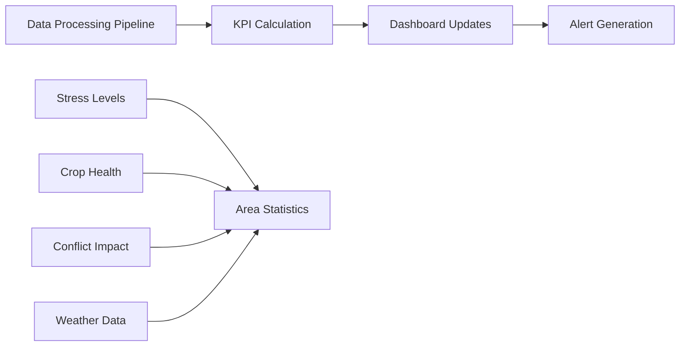

**Dashboard Components:**
1. **Regional Overview**: Province-level stress summary
2. **Temporal Trends**: Historical stress progression
3. **Alert Management**: Real-time notification system
4. **Interactive Maps**: Zoomable stress visualization
5. **Export Tools**: Data download and sharing capabilities

#### Alert System
**Alert Categories:**
- **Level 1**: Monitoring Alert (Low risk, watch recommended)
- **Level 2**: Attention Alert (Moderate risk, enhanced monitoring)
- **Level 3**: Warning Alert (High risk, intervention recommended)
- **Level 4**: Critical Alert (Severe risk, immediate action required)
- **Level 5**: Emergency Alert (Crisis level, humanitarian response needed)

### 2. Automated Reports

#### Weekly Monitoring Reports
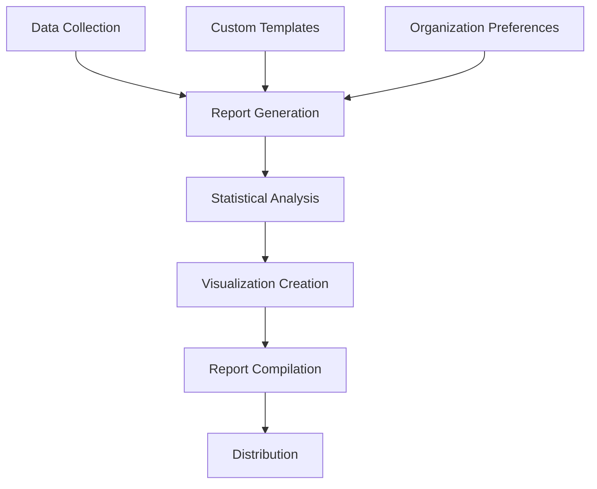

**Report Contents:**
1. **Executive Summary**: Key findings and recommendations
2. **Stress Assessment**: Regional stress level analysis
3. **Trend Analysis**: Historical comparison and projections
4. **Conflict Correlation**: Impact of conflict events on agriculture
5. **Recommendations**: Actionable intervention suggestions

#### Monthly Analytical Reports
**Enhanced Analysis:**
- **Seasonal Assessment**: Growing season performance analysis
- **Crop-specific Analysis**: Individual crop health monitoring
- **Comparative Analysis**: Inter-regional and temporal comparisons
- **Predictive Modeling**: Future risk assessment
- **Policy Implications**: Strategic recommendations

### 3. API and Data Access

#### RESTful API Endpoints
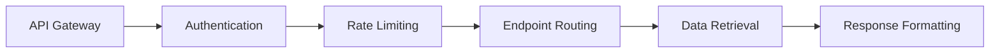

**Available Endpoints:**
- **GET /api/stress-maps**: Retrieve stress maps for specific regions
- **GET /api/vegetation-indices**: Access vegetation index data
- **GET /api/crop-classification**: Retrieve crop type maps
- **GET /api/alerts**: Access alert notifications
- **GET /api/reports**: Download generated reports
- **POST /api/custom-analysis**: Request custom analysis

**Data Formats:**
- **JSON**: Structured data for applications
- **GeoTIFF**: Raster data for GIS applications
- **GeoJSON**: Vector data for web mapping
- **CSV**: Tabular data for analysis
- **PDF**: Formatted reports for presentation

## Food Security Applications

### 1. Early Warning Systems

#### Food Security Risk Assessment
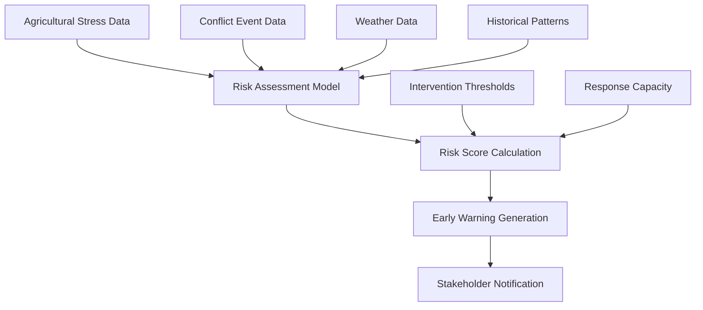

**Risk Indicators:**
1. **Agricultural Stress Levels**: Vegetation health indicators
2. **Conflict Intensity**: Security situation assessment
3. **Weather Anomalies**: Climate-related risks
4. **Historical Patterns**: Past food security events
5. **Market Conditions**: Food price and availability

**Early Warning Timeline:**
- **3-6 months**: Long-term risk assessment
- **1-3 months**: Medium-term warning
- **2-4 weeks**: Short-term alert
- **1-7 days**: Immediate crisis warning

### 2. Humanitarian Response Planning

#### Resource Allocation Optimization
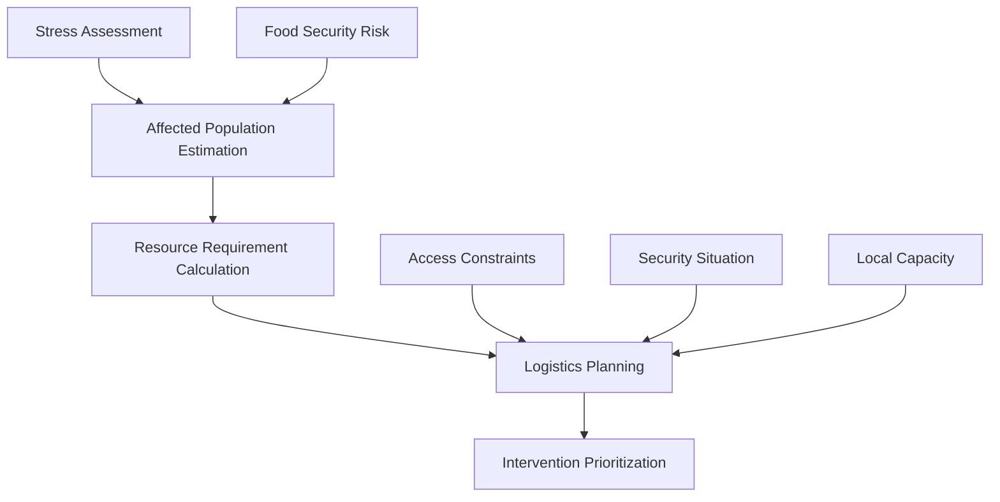

**Planning Applications:**
1. **Food Aid Distribution**: Optimal distribution point identification
2. **Agricultural Support**: Input distribution planning
3. **Emergency Response**: Rapid deployment planning
4. **Recovery Programs**: Post-crisis rehabilitation planning

#### Impact Assessment
**Monitoring Components:**
- **Intervention Effectiveness**: Before/after impact analysis
- **Coverage Assessment**: Geographic and demographic coverage
- **Outcome Measurement**: Food security improvement tracking
- **Cost-effectiveness**: Resource utilization efficiency

### 3. Agricultural Development Support

#### Extension Service Planning
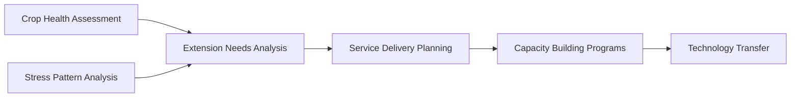

**Development Applications:**
1. **Crop Advisory Services**: Targeted agricultural advice
2. **Technology Adoption**: Precision agriculture promotion
3. **Capacity Building**: Farmer training programs
4. **Market Development**: Agricultural value chain support

#### Policy Support
**Policy Applications:**
- **Agricultural Policy**: Evidence-based policy formulation
- **Food Security Strategy**: National strategy development
- **Resource Allocation**: Budget allocation optimization
- **Monitoring and Evaluation**: Policy impact assessment

### 4. Research and Development

#### Agricultural Research Support
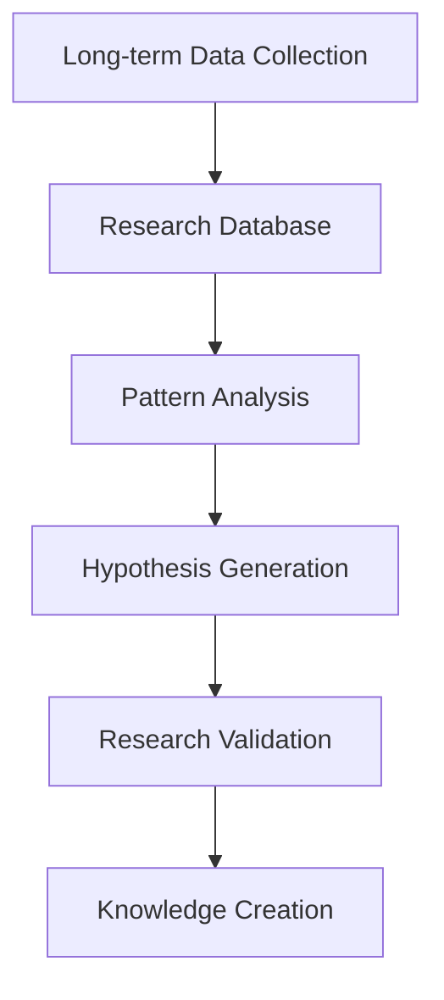

**Research Applications:**
1. **Climate Change Impact**: Long-term agricultural adaptation
2. **Crop Improvement**: Breeding program support
3. **Agricultural Innovation**: Technology development
4. **Policy Research**: Evidence-based policy analysis

#### Academic Collaboration
**Collaboration Areas:**
- **Universities**: Research partnership programs
- **Research Institutions**: Joint research projects
- **International Organizations**: Global research initiatives
- **Private Sector**: Innovation partnerships

## Data Quality and Validation

### Quality Assurance Framework
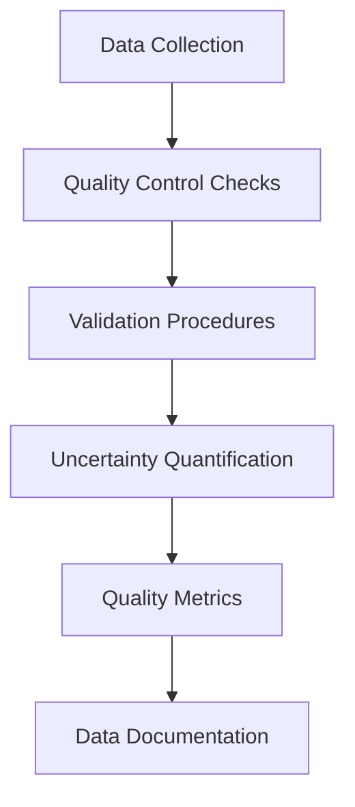

**Quality Measures:**
1. **Accuracy Assessment**: Ground truth validation where possible
2. **Precision Estimation**: Statistical uncertainty quantification
3. **Completeness Check**: Data coverage assessment
4. **Consistency Validation**: Cross-source verification
5. **Timeliness Monitoring**: Data freshness tracking

### Validation Methods
**Validation Approaches:**
- **Cross-validation**: Multiple model comparison
- **Expert Review**: Agricultural expert validation
- **Field Validation**: Limited ground truth collection
- **Statistical Validation**: Confidence interval estimation
- **Peer Review**: External validation by experts

## Integration with External Systems

### Humanitarian Information Systems
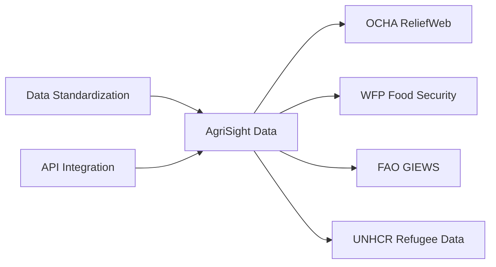

**Integration Partners:**
1. **United Nations Agencies**: OCHA, WFP, FAO, UNHCR
2. **International NGOs**: World Vision, Oxfam, Save the Children
3. **Government Agencies**: Ministry of Agriculture, National Food Security Authority
4. **Research Institutions**: Universities, think tanks
5. **Private Sector**: Agricultural companies, technology providers

### Data Sharing Protocols
**Sharing Mechanisms:**
- **Open Data**: Publicly available datasets
- **Restricted Access**: Organization-specific access
- **API Access**: Programmatic data access
- **Custom Feeds**: Tailored data streams
- **Emergency Access**: Rapid deployment protocols

## Future Enhancements

### Advanced Analytics
1. **Predictive Modeling**: Machine learning-based forecasting
2. **Scenario Analysis**: What-if analysis capabilities
3. **Optimization Algorithms**: Resource allocation optimization
4. **Real-time Processing**: Stream processing capabilities
5. **Multi-modal Fusion**: Integration of multiple data sources

### Enhanced Applications
1. **Mobile Applications**: Field data collection and access
2. **Blockchain Integration**: Secure data provenance
3. **IoT Integration**: Sensor data integration
4. **Social Media Mining**: Crowdsourced information
5. **Satellite Constellation**: Multi-satellite data fusion

### Capacity Building
1. **Training Programs**: User capacity development
2. **Technical Support**: Implementation assistance
3. **Documentation**: Comprehensive user guides
4. **Community Building**: User community development
5. **Knowledge Transfer**: Technology transfer programs

## Conclusion

AgriSight's comprehensive data output ecosystem provides critical support for food security monitoring and humanitarian response in conflict-affected regions. By combining advanced satellite imagery analysis with machine learning techniques, the system generates actionable insights that guide decision-making for multiple stakeholders.

The multi-layered approach to data generation, from pixel-level stress detection to regional risk assessment, ensures comprehensive coverage of agricultural conditions. The integration of conflict data provides crucial context for understanding agricultural stress patterns, while the real-time alert system enables rapid response to emerging food security threats.

The system's API-based architecture and flexible data formats ensure broad accessibility and integration with existing humanitarian and agricultural information systems. Continuous validation and quality assurance procedures maintain high data quality standards, while the modular design allows for ongoing enhancement and adaptation to evolving needs.

Through partnerships with humanitarian organizations, government agencies, and research institutions, AgriSight contributes to evidence-based decision-making that can help prevent food insecurity and support agricultural development in some of the world's most challenging environments.
