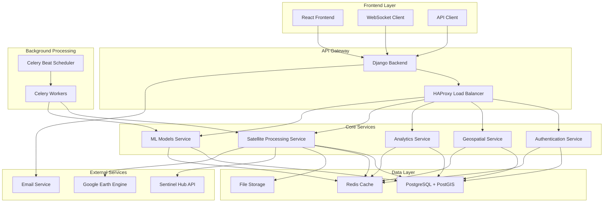
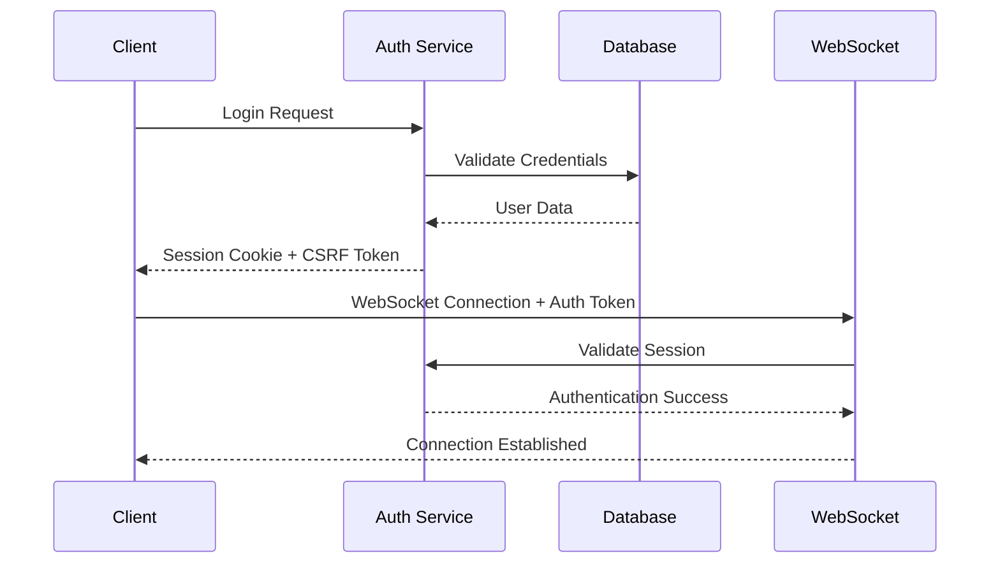
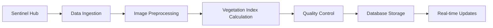
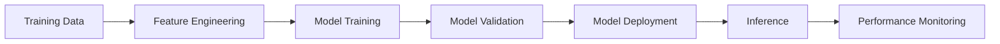

# AgriSight Architecture Documentation

## Overview

AgriSight is built using a modern microservices architecture that combines Django for the backend API, React for the frontend, and various specialized services for satellite data processing and real-time communication.

## System Architecture



## Technology Stack

### Frontend
- **React 19**: Modern React with hooks and functional components
- **Vite**: Fast build tool and development server
- **Tailwind CSS**: Utility-first CSS framework
- **Radix UI**: Accessible component library
- **React Query**: Data fetching and state management
- **Leaflet**: Interactive mapping library
- **Recharts**: Data visualization library
- **WebSocket**: Real-time communication

### Backend
- **Django 4.2**: Python web framework
- **Django REST Framework**: RESTful API framework
- **PostgreSQL 15**: Primary database
- **PostGIS**: Geospatial database extension
- **Redis**: Caching and message broker
- **Celery**: Asynchronous task processing
- **Channels**: WebSocket support
- **GDAL/GEOS**: Geospatial data processing

### Infrastructure
- **Docker**: Containerization
- **Docker Compose**: Multi-container orchestration
- **HAProxy**: Load balancing
- **Nginx**: Static file serving
- **Flower**: Celery monitoring

## Service Architecture

### 1. Authentication Service
**Location**: `apps/authentication/`

**Responsibilities:**
- User registration and login
- Session management
- CSRF protection
- Password reset functionality
- Social authentication (OAuth)

**Key Components:**
- `models.py`: User and session models
- `views.py`: Authentication endpoints
- `serializers.py`: Data serialization
- `middleware.py`: Security middleware

### 2. Geospatial Service
**Location**: `apps/geospatial/`

**Responsibilities:**
- Region management
- Satellite image storage
- Vegetation index calculations
- Geographic data processing

**Key Components:**
- `models.py`: Region, SatelliteImage, VegetationIndex models
- `views.py`: Geospatial API endpoints
- `processors.py`: Image processing utilities
- `serializers.py`: GeoJSON serialization

### 3. Analytics Service
**Location**: `apps/analytics/`

**Responsibilities:**
- Stress event analysis
- Conflict event tracking
- Trend analysis
- Statistical calculations

**Key Components:**
- `models.py`: StressEvent, ConflictEvent models
- `views.py`: Analytics API endpoints
- `algorithms.py`: Analysis algorithms
- `serializers.py`: Analytics data serialization

### 4. Satellite Processing Service
**Location**: `apps/satellite_processing/`

**Responsibilities:**
- Sentinel Hub integration
- Image preprocessing
- Vegetation index calculations
- Background processing coordination

**Key Components:**
- `processors.py`: Satellite data processors
- `tasks.py`: Celery background tasks
- `views.py`: Processing API endpoints
- `models.py`: Processing job models

### 5. Machine Learning Service
**Location**: `apps/ml_models/`

**Responsibilities:**
- Model training and inference
- Feature engineering
- Model versioning
- Performance monitoring

**Key Components:**
- `algorithms.py`: ML algorithm implementations
- `models.py`: Model metadata storage
- `tasks.py`: Training and inference tasks
- `views.py`: ML API endpoints

### 6. Core Services
**Location**: `apps/core/`

**Responsibilities:**
- WebSocket communication
- Security middleware
- Health monitoring
- Common utilities

**Key Components:**
- `consumers.py`: WebSocket consumers
- `middleware.py`: Security and monitoring middleware
- `websocket_service.py`: Real-time messaging
- `routing.py`: WebSocket routing

## Data Architecture

### Database Design

#### Core Tables
```sql
-- Users and Authentication
users_user
organizations_organization
authentication_session

-- Geospatial Data
geospatial_region
geospatial_satelliteimage
geospatial_vegetationindex
geospatial_crop
geospatial_cropmapping

-- Analytics
analytics_agriculturalstressevent
analytics_conflictevent

-- Machine Learning
ml_models_mlmodel
ml_models_modeltraining
ml_models_prediction

-- Reports and Alerts
reports_alerts_report
reports_alerts_alert
```

#### Key Relationships
- Users belong to Organizations
- Regions are accessible by Organizations
- Satellite Images are associated with Regions
- Vegetation Indices are calculated from Satellite Images
- Stress Events are detected in Regions
- ML Models make predictions on Regions

### Data Flow

1. **Satellite Data Ingestion**
   ```
   Sentinel Hub API → Satellite Processing Service → PostgreSQL
   ```

2. **Vegetation Index Calculation**
   ```
   Raw Satellite Data → GDAL Processing → Vegetation Indices → Database
   ```

3. **Stress Event Detection**
   ```
   Vegetation Data → ML Models → Stress Events → Real-time Alerts
   ```

4. **Real-time Updates**
   ```
   Database Changes → WebSocket Service → Frontend Clients
   ```

## Security Architecture

### Authentication Flow


### Security Layers

1. **Network Security**
   - HTTPS/WSS encryption
   - CORS configuration
   - Rate limiting

2. **Application Security**
   - CSRF protection
   - Session security
   - Input validation
   - SQL injection prevention

3. **Data Security**
   - Encrypted data transmission
   - Secure session storage
   - Access control lists
   - Audit logging

## Scalability Architecture

### Horizontal Scaling

#### Frontend Scaling
- CDN for static assets
- Multiple frontend instances
- Load balancing with HAProxy

#### Backend Scaling
- Multiple Django instances
- Database read replicas
- Redis clustering
- Celery worker scaling

#### Database Scaling
- PostgreSQL read replicas
- Connection pooling
- Query optimization
- Indexing strategy

### Performance Optimization

#### Caching Strategy
```python
# Multi-level caching
1. Browser Cache (Static Assets)
2. CDN Cache (Global Distribution)
3. Redis Cache (Application Data)
4. Database Cache (Query Results)
```

#### Database Optimization
- Proper indexing on frequently queried fields
- Query optimization and profiling
- Connection pooling
- Read/write splitting

## Deployment Architecture

### Development Environment
```yaml
services:
  - frontend (React + Vite)
  - backend (Django)
  - postgres (PostgreSQL + PostGIS)
  - redis (Redis)
  - celery_worker (Celery)
  - celery_beat (Scheduler)
```

### Production Environment
```yaml
services:
  - nginx (Load Balancer + Static Files)
  - haproxy (Application Load Balancer)
  - frontend (Multiple React Instances)
  - backend (Multiple Django Instances)
  - postgres_primary (Primary Database)
  - postgres_replica (Read Replica)
  - redis_cluster (Redis Cluster)
  - celery_workers (Multiple Workers)
  - flower (Monitoring)
```

## Monitoring and Observability

### Application Monitoring
- **Health Checks**: `/health/` and `/health/detailed/`
- **Performance Metrics**: Request timing, database queries
- **Error Tracking**: Structured logging and error reporting
- **User Analytics**: Usage patterns and feature adoption

### Infrastructure Monitoring
- **System Metrics**: CPU, memory, disk usage
- **Database Metrics**: Connection pools, query performance
- **Cache Metrics**: Hit rates, memory usage
- **Queue Metrics**: Task processing rates, queue lengths

### Logging Strategy
```python
# Structured logging levels
DEBUG: Development debugging
INFO: General application flow
WARNING: Potential issues
ERROR: Error conditions
CRITICAL: System failures
```

## API Architecture

### RESTful Design Principles
- Resource-based URLs
- HTTP methods for operations
- Stateless communication
- Consistent response formats
- Proper HTTP status codes

### API Versioning
- URL-based versioning: `/api/v1/`
- Backward compatibility
- Deprecation strategy
- Migration guides

### WebSocket Architecture
```python
# WebSocket routing
/ws/ -> Main consumer for general updates
/ws/region/{id}/ -> Region-specific updates
/ws/processing/{task_id}/ -> Task-specific updates
```

## Data Processing Pipeline

### Satellite Data Processing


### Machine Learning Pipeline


## Integration Architecture

### External Service Integration
- **Sentinel Hub**: Satellite imagery API
- **Google Earth Engine**: Additional satellite data
- **Email Services**: SMTP for notifications
- **SMS Services**: Twilio for alerts

### API Integration Patterns
- **Synchronous**: Direct API calls for real-time data
- **Asynchronous**: Background processing for heavy operations
- **Webhook**: Event-driven integrations
- **Batch Processing**: Scheduled data synchronization

## Disaster Recovery

### Backup Strategy
- **Database Backups**: Daily automated backups
- **File Storage Backups**: Regular file system backups
- **Configuration Backups**: Infrastructure as Code
- **Cross-region Replication**: Geographic redundancy

### Recovery Procedures
- **RTO (Recovery Time Objective)**: 4 hours
- **RPO (Recovery Point Objective)**: 1 hour
- **Automated Failover**: Database and application level
- **Manual Procedures**: Documented recovery steps

## Future Architecture Considerations

### Microservices Evolution
- Service mesh implementation
- API gateway centralization
- Event-driven architecture
- Domain-driven design

### Cloud Migration
- Container orchestration (Kubernetes)
- Serverless functions
- Managed services adoption
- Auto-scaling capabilities

### Advanced Features
- GraphQL API layer
- Real-time collaboration
- Advanced ML pipelines
- IoT device integration

---

*This architecture document is maintained alongside the codebase and updated as the system evolves.*
