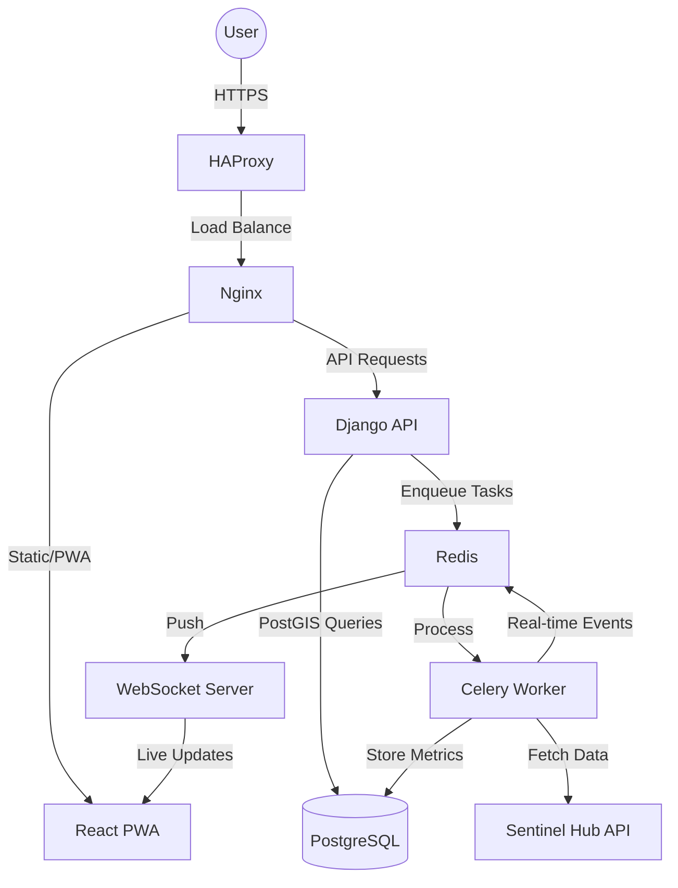
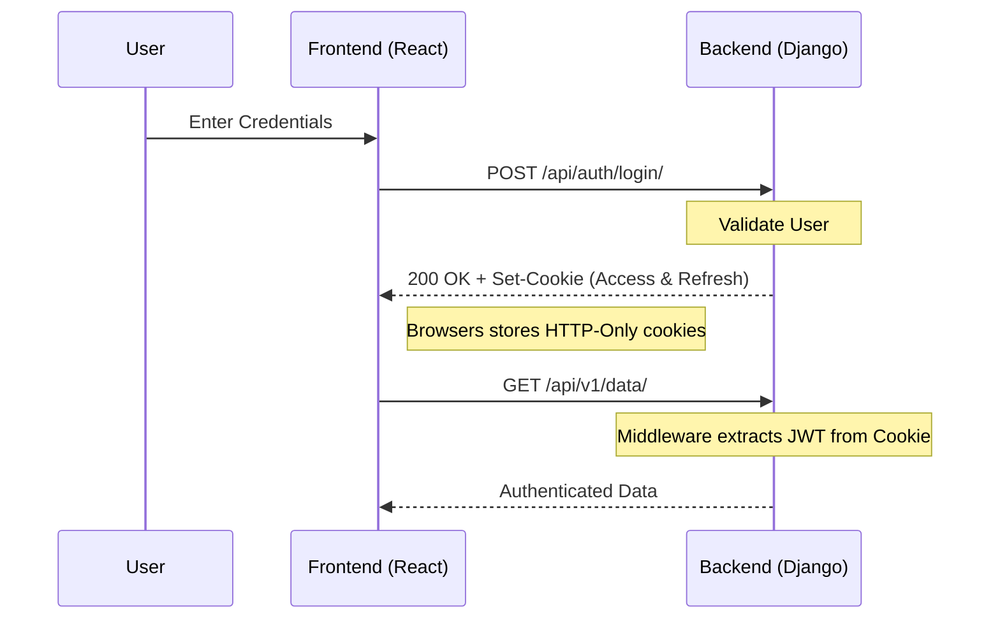
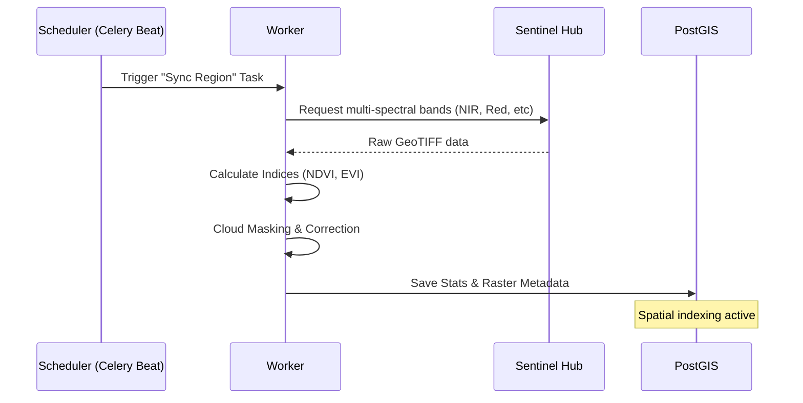
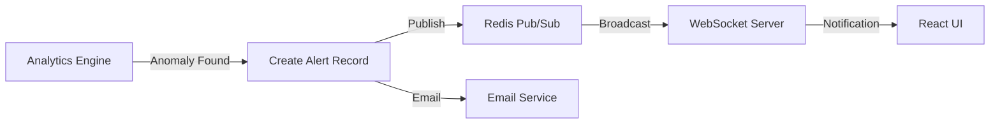

# Architecture & Workflows

AgriSight is built with a decoupled architecture focusing on scalability, reliability, and geospatial precision.

## System Overview

---

## Core Workflows

### 1. Authentication Handshake (JWT-in-Cookies)
The system uses HTTP-Only cookies to protect against XSS while maintaining a stateless backend.

### 2. Satellite Data Pipeline
How satellite imagery becomes actionable agricultural insights.

### 3. Real-time Anomaly Detection
The flow from detection to user notification.

---

## Module breakdown

### Backend (Django Apps)
- `apps.geospatial`: PostGIS models for regions and satellite metadata.
- `apps.satellite_processing`: Task logic for calculating vegetation indices.
- `apps.analytics`: Stress detection algorithms and trend analysis.
- `apps.core`: Base models (SoftDelete, Timestamped) and custom middleware.

### Frontend (React)
- `src/pages`: Main view logic (Dashboard, MapView).
- `src/lib/apiClient`: Centralized Axios instance with refresh interceptors.
- `src/components/ui`: Radix-based design system.
- `src/contexts`: Global state for Auth, WebSockets, and Errors.
